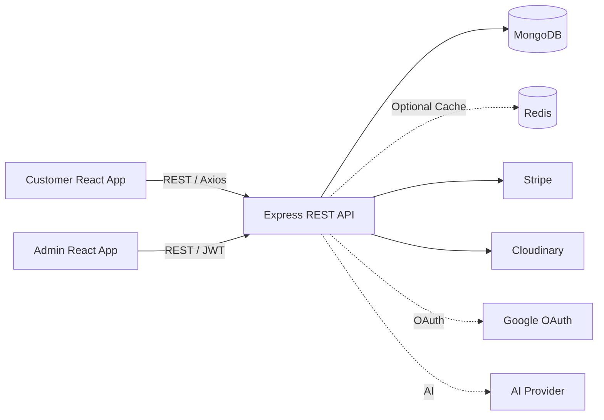

# 🍅 Tomato — Full-Stack Food Delivery Platform

> A production-oriented food delivery platform built with **React, Node.js, Express, MongoDB, Redis, Stripe, Google OAuth, Cloudinary, and AI-powered assistance**.

Tomato is a full-stack food delivery platform designed to demonstrate how a modern web application can combine **customer-facing experiences, administrative operations, secure authentication, payments, caching, media management, automated testing, and AI-assisted functionality** into a single system.

The project consists of three independently managed applications:

* 🛒 **Customer Application** — Browse food, manage carts, checkout, track orders, and interact with the chatbot.
* 🛠️ **Admin Dashboard** — Manage food, customers, orders, and order statuses.
* ⚙️ **Backend API** — Centralized REST API handling authentication, authorization, business logic, payments, caching, AI services, and external integrations.

---

## ✨ Why Tomato?

Tomato was built to go beyond a basic CRUD food-delivery application.

The project focuses on implementing features commonly found in real-world production systems:

| Capability        | Implementation                           |
| ----------------- | ---------------------------------------- |
| 🔐 Authentication | JWT + Google OAuth 2.0                   |
| 🛡️ Authorization | Role-Based Access Control                |
| 💳 Payments       | Stripe Checkout                          |
| ⚡ Performance     | Redis caching + MongoDB indexes          |
| 🤖 AI             | AI-assisted food search & order tracking |
| ☁️ Media          | Cloudinary + Multer                      |
| 🧪 Testing        | Vitest + MongoDB Memory Server           |
| 🗄️ Database      | MongoDB + Mongoose                       |
| 🌐 Frontend       | React + Vite                             |
| 🔌 API            | Node.js + Express                        |

---

## 🎥 Demo

### Live Application

[**🌐 View Live Application →**](YOUR_DEPLOYMENT_URL)

> Replace the placeholders above with the deployed URLs before publishing the repository.

### Demo Video

📹 **[Watch the full project demonstration](YOUR_DEMO_VIDEO_URL)**

The demo covers:

1. Customer registration and login
2. Google OAuth authentication
3. Menu browsing and category filtering
4. Guest cart functionality
5. Authenticated cart persistence
6. Checkout and Stripe payment flow
7. Order history and tracking
8. AI chatbot interaction
9. Admin authentication
10. Food management
11. Customer management
12. Order management and status updates

---

## 📸 Product Preview

Add screenshots/GIFs here before publishing the project.

### Customer Experience

`Home → Menu → Food → Cart → Checkout → Orders`

### Administration

`Admin Login → Dashboard → Food Management → Customers → Orders`

Recommended screenshots:

* Customer landing page
* Menu/category filtering
* Cart
* Stripe checkout
* My Orders
* AI chatbot
* Admin dashboard
* Food management
* Order management

---

# 🚀 Core Features

## 👤 Customer Experience

### 🍔 Menu & Food Discovery

* Browse available food items
* Filter food by category
* View food information and pricing
* Search food through the chatbot

### 🛒 Smart Cart System

Supports two cart modes:

**Guest users**

* Cart stored locally using `localStorage`

**Authenticated users**

* Cart persisted in MongoDB
* Cart accessible across authenticated sessions

### 🔐 Authentication

* Email/password registration
* Secure bcrypt password hashing
* JWT-based authentication
* Google OAuth 2.0
* Authentication state management
* Protected routes

### 💳 Stripe Checkout

Complete payment workflow:

```text
Customer
   ↓
Cart
   ↓
Delivery Information
   ↓
Create Order
   ↓
Stripe Checkout
   ↓
Payment Verification
   ↓
Order Confirmation
```

### 📦 Order Management

Customers can:

* View previous orders
* View order status
* Track their latest order
* Access order history

### 🤖 AI-Assisted Chatbot

The chatbot supports:

* Menu/food discovery
* Food-related queries
* Latest-order tracking
* AI-powered responses when configured
* Deterministic local matching fallback

This allows the application to remain useful even when an external AI provider is unavailable.

---

# 🛠️ Admin Dashboard

The administrative application provides protected operational functionality.

### Food Management

* Add food
* Upload food images
* List food
* Remove food

### Order Management

* View all orders
* Filter and sort orders
* Update order status
* View customer order summaries

### Customer Management

* View customer records
* View customer order summaries

### Authorization

Administrative APIs require:

```text
JWT Authentication
        +
Admin Role
        ↓
Protected Resource
```

This prevents regular customers from accessing administrative operations.

---

# 🧠 Engineering Highlights

## 🔐 Authentication + RBAC

Tomato implements authentication and authorization separately.

Authentication answers:

> "Who is this user?"

Authorization answers:

> "What is this user allowed to do?"

JWT tokens contain the user identity and role, while backend middleware enforces administrative permissions.

---

## 🌐 Google OAuth 2.0

Users can authenticate using Google when OAuth credentials are configured.

The authentication flow is:

```text
User
 ↓
Google
 ↓
OAuth Callback
 ↓
Backend
 ↓
User Lookup / Creation
 ↓
JWT
 ↓
Customer Application
```

---

## ⚡ Redis Caching

Redis is used to reduce repeated database reads for frequently requested data.

Current caching strategy includes:

```text
Food List
TTL → 300 seconds

User Orders
TTL → 60 seconds

Admin Orders
TTL → 30 seconds
```

Order mutations invalidate related cached data to reduce stale results.

Redis is implemented as an **optional dependency** with fail-open behavior, allowing the API to continue operating when Redis is unavailable.

---

## 💳 Payment Architecture

Stripe Checkout is integrated into the order workflow.

```text
Cart
 ↓
Create Order
 ↓
Create Stripe Session
 ↓
Redirect to Stripe
 ↓
Payment
 ↓
Verification
 ↓
Order Status
```

> Production hardening should include Stripe webhooks and idempotent payment processing rather than relying solely on browser redirects.

---

## 🤖 AI + Fallback Architecture

The chatbot uses an OpenAI-compatible API when configured.

The application also includes deterministic local matching.

```text
User Query
    ↓
Chat Service
    ↓
AI Provider Available?
   / \
 Yes  No
  ↓    ↓
 AI   Local Matching
  \    /
   Response
```

This architecture prevents the chatbot from becoming completely dependent on an external AI provider.

---

## ☁️ Cloudinary Media Pipeline

Food images are uploaded using Multer and transferred to Cloudinary.

```text
Browser
   ↓
Multer Memory Upload
   ↓
Backend
   ↓
Cloudinary
   ↓
Image URL + Public ID
   ↓
MongoDB
```

The application server therefore does not need to permanently store uploaded images.

---

# 🏗️ System Architecture



### Request Lifecycle

```text
React UI
   ↓
Axios
   ↓
REST API
   ↓
Authentication / Authorization
   ↓
Controller
   ↓
Service
   ↓
Database / Cache / External Provider
   ↓
Response
   ↓
React UI
```

---

# 🧰 Technology Stack

| Layer          | Technology                               |
| -------------- | ---------------------------------------- |
| Frontend       | React 19, Vite, React Router, Axios      |
| Admin          | React 19, Vite, React Router             |
| Backend        | Node.js 22, Express 5                    |
| Database       | MongoDB, Mongoose                        |
| Authentication | JWT, bcrypt                              |
| OAuth          | Passport, Google OAuth 2.0               |
| Payments       | Stripe Checkout                          |
| Cache          | Redis                                    |
| Media          | Cloudinary, Multer, Streamifier          |
| AI             | OpenAI-compatible API                    |
| Testing        | Vitest, MongoDB Memory Server            |
| Deployment     | Vercel-compatible frontend configuration |

---

# 📁 Project Structure

```text
food-del/
│
├── frontend/
│   └── src/
│       ├── components/
│       ├── pages/
│       └── Context/
│
├── admin/
│   └── src/
│       ├── Components/
│       ├── Pages/
│       └── api/
│
└── backend/
    ├── config/
    ├── controllers/
    ├── middleware/
    ├── models/
    ├── routes/
    ├── services/
    ├── scripts/
    └── tests/
        └── unit/
```

---

# 🗄️ Database Design

### User

```text
User
├── name
├── email
├── password
├── role
├── provider
├── providerId
└── cartData
```

### Food

```text
Food
├── name
├── description
├── price
├── image
├── imagePublicId
└── category
```

### Order

```text
Order
├── userId
├── items
├── type
├── amount
├── address
├── status
├── date
└── payment
```

Indexes are used for user order history and newest-first order queries.

---

# 🔌 API Overview

### Public APIs

| Method | Endpoint                    | Purpose             |
| ------ | --------------------------- | ------------------- |
| GET    | `/api/food/list`            | Retrieve menu       |
| POST   | `/api/user/register`        | Register customer   |
| POST   | `/api/user/login`           | Login               |
| GET    | `/api/user/google`          | Start Google OAuth  |
| GET    | `/api/user/google/callback` | OAuth callback      |
| POST   | `/api/order/verify`         | Verify checkout     |
| POST   | `/api/chat/message`         | Chatbot interaction |

### Authenticated APIs

| Method | Endpoint                | Purpose              |
| ------ | ----------------------- | -------------------- |
| GET    | `/api/user/me`          | Current user         |
| POST   | `/api/cart/add`         | Add cart item        |
| POST   | `/api/cart/remove`      | Remove cart item     |
| POST   | `/api/cart/get`         | Retrieve cart        |
| POST   | `/api/order/place`      | Create order         |
| POST   | `/api/order/userorders` | Retrieve user orders |

### Admin APIs

| Method | Endpoint                      | Purpose             |
| ------ | ----------------------------- | ------------------- |
| POST   | `/api/food/add`               | Add food            |
| POST   | `/api/food/remove`            | Remove food         |
| GET    | `/api/order/list`             | List orders         |
| GET    | `/api/order/customer-summary` | Customer summaries  |
| PUT    | `/api/order/status/:orderId`  | Update order status |

---

# 🧪 Testing

Backend testing is implemented using **Vitest** with MongoDB Memory Server support.

Current unit-test areas include:

* AI chat service
* Redis operations
* Chat controller
* Food-service caching
* Order-controller caching

### Run tests

```bash
cd backend

npm test
```

Watch mode:

```bash
npm run test:watch
```

Coverage:

```bash
npm run test:coverage
```

Frontend, end-to-end, and route-level Supertest coverage are not currently implemented.

---

# ⚙️ Local Development

## Prerequisites

* Node.js 22+
* npm 10+
* MongoDB

Optional services:

* Redis
* Stripe
* Cloudinary
* Google OAuth
* OpenAI-compatible AI provider

---

## Installation

```bash
git clone YOUR_REPOSITORY_URL

cd food-del

cd backend
npm install

cd ../frontend
npm install

cd ../admin
npm install
```

---

## Start Backend

```bash
cd backend
npm run server
```

## Start Customer Application

```bash
cd frontend
npm run dev
```

## Start Admin Application

```bash
cd admin
npm run dev
```

### Default Local URLs

```text
Backend   → http://localhost:4000
Customer  → http://localhost:5180
Admin     → http://localhost:5181
```

---

# 🔑 Environment Variables

Create:

```text
backend/.env
frontend/.env
admin/.env
```

Never commit real credentials.

### Backend

```env
MONGODB_URI=
JWT_SECRET=

PORT=4000
HOST=0.0.0.0

FRONTEND_URL=
CUSTOMER_URL=
ADMIN_URL=
CORS_ORIGINS=

REDIS_URL=

STRIPE_SECRET_KEY=

CLOUDINARY_CLOUD_NAME=
CLOUDINARY_API_KEY=
CLOUDINARY_API_SECRET=

GOOGLE_CLIENT_ID=
GOOGLE_CLIENT_SECRET=
GOOGLE_CALLBACK_URL=

OPENAI_API_KEY=
OPENAI_MODEL=
OPENAI_BASE_URL=
```

### Customer

```env
VITE_API_URL=http://localhost:4000
VITE_ADMIN_URL=
VITE_PORT=5180
```

### Admin

```env
VITE_API_URL=http://localhost:4000
VITE_CUSTOMER_URL=http://localhost:5180
VITE_PORT=5181
```

---

# 🔒 Security

Implemented:

* JWT authentication
* Role-based authorization
* bcrypt password hashing
* CORS configuration
* Email/password validation
* Image MIME validation
* Request body limits
* Menu-ID validation for AI search results

### Production Hardening Roadmap

Before treating the application as production-ready:

* Add Stripe webhooks
* Implement idempotent payment processing
* Use secure HTTP-only cookies
* Add Helmet
* Add rate limiting
* Add request schema validation
* Add centralized error handling
* Add audit logging
* Harden CORS configuration
* Remove hard-coded administrative account behavior
* Rotate any credentials that may have been exposed

---

# 📈 Performance & Optimization

Tomato includes several performance-oriented techniques:

### Redis

```text
Food list              → 300s TTL
User orders            → 60s TTL
Admin order data       → 30s TTL
```

### MongoDB

Indexes support:

```text
userId + date
date
```

### API

* Lean MongoDB queries for uncached reads
* Cache invalidation after mutations
* Optional Redis architecture
* Fail-open cache behavior

### Media

Cloudinary transformations provide automatic format and quality optimization.

---

# 🧩 Challenges & Engineering Solutions

| Challenge                    | Solution                               |
| ---------------------------- | -------------------------------------- |
| Guest vs authenticated carts | Local storage + MongoDB-backed carts   |
| Redis availability           | Optional cache with fail-open behavior |
| Image storage                | Multer memory upload + Cloudinary      |
| AI provider availability     | AI provider + local fallback           |
| Admin security               | JWT + role-based middleware            |
| React Router deployment      | Vercel SPA rewrites                    |
| Repeated order queries       | Redis caching + invalidation           |
| OAuth authentication         | Passport + Google OAuth                |

---

# 📚 What This Project Demonstrates

Tomato demonstrates practical experience with:

* Full-stack application architecture
* REST API design
* React application development
* Authentication and authorization
* OAuth 2.0
* Role-Based Access Control
* Payment integration
* Redis caching
* MongoDB data modeling
* Cloud media storage
* AI integration
* Automated testing
* API security
* Cache invalidation
* External-service integration
* Multi-application architecture

---

# 🗺️ Future Roadmap

### Phase 1 — Production Hardening

* Stripe webhook integration
* Idempotent payment processing
* Secure HTTP-only authentication cookies
* Rate limiting
* Helmet
* Schema validation
* Centralized error handling
* CI/CD pipeline

### Phase 2 — Product Improvements

* Guest/authenticated cart merging
* Pagination
* Advanced menu search
* Coupons and discounts
* Refund management
* Notifications
* Delivery tracking
* Inventory management

### Phase 3 — Testing & Developer Experience

* Frontend unit tests
* Integration tests
* End-to-end tests
* API documentation
* OpenAPI/Swagger
* `.env.example`
* Automated CI checks

### Phase 4 — AI Expansion

* Natural-language food discovery
* Personalized recommendations
* Order assistance
* Customer support automation
* Context-aware conversational ordering

---

# 📊 Project Snapshot

| Metric                  | Value |
| ----------------------- | ----: |
| Applications            |     3 |
| Frontend files          |    96 |
| Admin files             |    27 |
| Backend files           |    82 |
| Backend route modules   |     5 |
| Mongoose models         |     4 |
| Backend unit-test files |     6 |

> Repository statistics represent the current project snapshot and may change as development continues.

---

# 👨‍💻 Author

**Harish**

Full-Stack Developer | MERN | AI Integration

* GitHub: `YOUR_GITHUB_URL`
* LinkedIn: `YOUR_LINKEDIN_URL`
* Portfolio: `YOUR_PORTFOLIO_URL`
* Email: `YOUR_EMAIL`

---

# 📄 License

No root-level project license is currently defined.

Add an appropriate `LICENSE` file before distributing the project publicly.

---

## ⭐ If You Found This Project Interesting

If this project helped you understand full-stack development, authentication, payments, caching, AI integration, or production-oriented architecture, consider giving the repository a ⭐.

---

> **Built to learn. Built to solve real problems. Built with production engineering principles in mind.**
