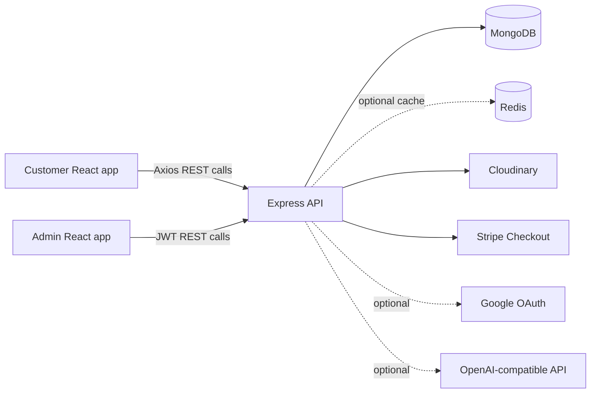

# Tomato Food Delivery Platform

Full-stack food-delivery application with a customer storefront, an admin dashboard, and an Express/MongoDB API. The platform supports menu browsing, guest and authenticated carts, Stripe checkout, order tracking, food-image uploads, Google OAuth, Redis caching, and an optional AI-assisted chatbot.

## 1. Project Header

**Project:** Tomato Food Delivery Platform  
**Repository:** `food-del`  
**Architecture:** Three independently managed applications in one repository  
**Status:** Functional full-stack project; production hardening and deployment details remain platform-specific.

## 2. Project Overview

Tomato is split into:

- `frontend/`: customer-facing React/Vite web application.
- `admin/`: protected React/Vite administration dashboard.
- `backend/`: Express API responsible for authentication, menu data, carts, orders, payments, chatbot requests, caching, and external integrations.

Customers can browse categorized food, maintain a cart as a guest or signed-in user, pay through Stripe Checkout, and view order history. Administrators can manage food, review customers and orders, and update order status.

## 3. Live Demo

No verified production URL is stored in this repository. Configure the URLs below for a deployment:

- Customer app: `<CUSTOMER_APP_URL>`
- Admin app: `<ADMIN_APP_URL>`
- API: `<API_URL>`

The backend contains a legacy default allowed origin for `https://tomato-frontend2-lime.vercel.app`; treat it as configuration evidence, not as a verified live demo.

## 4. Demo Video

No demo video is committed or linked in the repository.

Recommended recording flow:

1. Browse the menu and filter by category.
2. Add items as a guest, then register or sign in.
3. Complete delivery details and Stripe Checkout.
4. Show the order in **My Orders**.
5. Sign in to the admin app and demonstrate food management and order-status updates.

## 5. Screenshots / Product Preview

No screenshots are committed. Suggested preview captures:

- Customer home page and menu categories.
- Food detail/card and cart state.
- Delivery form and payment redirect.
- My Orders page with status.
- Admin food list/add-food form.
- Admin orders and customer summary views.

## 6. Key Features

### Customer experience

- Food listing with category filtering.
- Guest cart persistence in `localStorage`.
- Authenticated cart persistence in MongoDB.
- Local email/password registration and login.
- Optional Google OAuth login.
- Delivery-information form and Stripe Checkout redirect.
- Payment verification and order history.
- Chatbot support for menu search and latest-order tracking.

### Administration

- Admin-only login and protected routes.
- Add food with image upload.
- List and remove food.
- View all orders.
- Filter and sort orders in the dashboard.
- Update order status.
- View customer records and customer order summaries.

## 7. Technical Highlights

- React 19 and Vite for both web clients.
- Express 5 API using ES modules.
- Mongoose models for users, food, orders, and OAuth-code support.
- JWT authentication with role claims.
- Google OAuth through Passport when configured.
- Stripe Checkout session creation.
- Cloudinary image storage using in-memory Multer uploads.
- Optional Redis caching with fail-open behavior.
- OpenAI-compatible chat-completions integration with local fallback matching.
- Vitest unit tests with MongoDB Memory Server available for isolated tests.
- Vercel SPA rewrites for both Vite applications.

## 8. Tech Stack

| Layer | Technology |
|---|---|
| Customer UI | React 19, React Router, Axios, Vite |
| Admin UI | React 19, React Router, Axios, React Toastify, Vite |
| API | Node.js 22, Express 5, Body Parser, CORS |
| Database | MongoDB with Mongoose 9 |
| Cache | Redis via `redis` client |
| Authentication | JWT, bcrypt, Passport Google OAuth 2.0 |
| Payments | Stripe Checkout |
| Media | Cloudinary, Multer, Streamifier |
| AI | OpenAI-compatible chat-completions endpoint |
| Testing | Vitest, MongoDB Memory Server, Supertest dependency |
| Deployment config | Vercel SPA rewrites for frontend and admin |

Node.js `22.x` and npm `>=10` are declared by all three packages.

## 9. System Architecture



The request path is generally:

```text
React view -> API route -> auth/role middleware -> controller -> service/model -> external provider or database
```

## 10. Application Workflow

### Browse and cart

1. The customer app loads `GET /api/food/list`.
2. Guests store cart quantities under `localStorage.cartItems`.
3. Signed-in customers use `/api/cart/add`, `/api/cart/remove`, and `/api/cart/get`; the server stores quantities in `user.cartData`.
4. On login, the server cart is loaded and the guest cart is removed. The current implementation does not merge both carts.

### Checkout

1. The customer submits delivery details and cart items.
2. The API creates an unpaid order and clears the server cart.
3. The API creates a Stripe Checkout session and returns `session_url`.
4. Stripe redirects to `/verify` with `success` and `orderId` query parameters.
5. The customer app calls `/api/order/verify` and navigates to **My Orders** on success.

### Admin order lifecycle

The supported statuses are `Food Processing`, `confirmed`, `preparing`, `out for delivery`, and `delivered`. Admin changes invalidate order-related Redis caches.

## 11. Project Structure

```text
food-del/
├── frontend/                 # Customer React/Vite application
│   └── src/
│       ├── components/       # Navbar, menu, food cards, chatbot, auth, footer
│       ├── pages/            # Home, Cart, PlaceOrder, Verify, MyOrders, OAuth
│       └── Context/           # StoreContext cart and API state
├── admin/                    # Admin React/Vite application
│   └── src/
│       ├── Components/       # Navbar, sidebar, protected route
│       ├── Pages/            # Add, List, Orders, Customers, Login, OAuth
│       └── api/              # Axios API client and auth interceptor
└── backend/                  # Express API
    ├── config/               # Database, Redis, Cloudinary, Passport
    ├── controllers/          # User, food, cart, order, chat behavior
    ├── middleware/            # JWT auth, optional auth, role checks
    ├── models/               # Mongoose schemas
    ├── routes/               # REST route registration
    ├── services/              # Cache, upload, food, AI chat services
    ├── scripts/               # Admin-account utility
    └── tests/unit/            # Vitest unit tests
```

## 12. Database Design

### `food`

| Field | Type | Notes |
|---|---|---|
| `name` | String | Required |
| `description` | String | Required |
| `price` | Number | Required |
| `image` | String | Required; normally Cloudinary URL |
| `imagePublicId` | String | Cloudinary deletion reference |
| `category` | String | Required |

### `user`

| Field | Type | Notes |
|---|---|---|
| `name` | String | Required |
| `email` | String | Required, unique, lowercase, trimmed |
| `password` | String | Required for local accounts; bcrypt hash |
| `role` | Enum | `customer` or `admin` |
| `provider` | Enum | `local` or `google` |
| `providerId` | String | Sparse Google provider identifier |
| `cartData` | Object | Authenticated cart quantities |

### `Orders`

Orders contain `userId`, `items`, `type`, `amount`, `address`, `status`, `date`, and `payment`. Indexes exist on `{ userId: 1, date: -1 }` and `{ date: -1 }`.

### OAuth support

`oauthCodeModel.js` defines an OAuth-code document with expiry and used-state fields, but it is not referenced by the active routes/controllers and is not part of the current login flow.

## 13. API Documentation

Base URL: `http://localhost:4000` locally, or the deployed API URL.

Authentication accepts either `Authorization: Bearer <JWT>` or `token: <JWT>`.

### Public endpoints

| Method | Endpoint | Purpose |
|---|---|---|
| `GET` | `/` | API availability response |
| `GET` | `/health` | Health response |
| `GET` | `/api/food/list` | List menu items |
| `POST` | `/api/user/register` | Create a customer account |
| `POST` | `/api/user/login` | Authenticate local account |
| `GET` | `/api/user/google` | Start Google OAuth when configured |
| `GET` | `/api/user/google/callback` | Complete Google OAuth |
| `POST` | `/api/order/verify` | Mark or cancel a checkout order |
| `POST` | `/api/chat/message` | Search menu or track an order |

### Authenticated endpoints

| Method | Endpoint | Purpose |
|---|---|---|
| `GET` | `/api/user/me` | Return current user |
| `POST` | `/api/cart/add` | Increment a cart item |
| `POST` | `/api/cart/remove` | Decrement a cart item |
| `POST` | `/api/cart/get` | Return server cart |
| `POST` | `/api/order/place` | Create order and Stripe session |
| `POST` | `/api/order/userorders` | Return current user's orders |

### Admin endpoints

| Method | Endpoint | Purpose |
|---|---|---|
| `POST` | `/api/food/add` | Multipart food creation; field: `image` |
| `POST` | `/api/food/remove` | Delete food and Cloudinary asset |
| `GET` | `/api/order/list` | List all orders |
| `GET` | `/api/order/customer-summary` | Customer order summaries; optional `?date=YYYY-MM-DD` |
| `PUT` | `/api/order/status/:orderId` | Set a valid order status |

### Example requests

Register:

```json
POST /api/user/register
{
  "name": "Ada Lovelace",
  "email": "ada@example.com",
  "password": "at-least-8-characters"
}
```

Place order:

```json
POST /api/order/place
{
  "items": [{ "_id": "food-id", "name": "Pasta", "price": 12, "quantity": 2 }],
  "amount": 26,
  "address": {
    "firstName": "Ada",
    "lastName": "Lovelace",
    "email": "ada@example.com",
    "street": "1 Example Street",
    "city": "London",
    "state": "London",
    "zipCode": "SW1A 1AA",
    "country": "UK",
    "phone": "+440000000000"
  }
}
```

The successful order response contains `session_url` for Stripe Checkout. Response shapes consistently include `success` and, where applicable, `message` or `data`.

## 14. Authentication & Authorization

- Local registration only creates `customer` accounts.
- Passwords are validated to a minimum of eight characters and hashed with bcrypt.
- Login JWTs contain the user ID and role and expire after one day.
- Google OAuth is enabled only when `GOOGLE_CLIENT_ID`, `GOOGLE_CLIENT_SECRET`, and `GOOGLE_CALLBACK_URL` are all configured.
- OAuth state is signed with JWT and expires after ten minutes.
- Admin routes require both valid JWT authentication and `requireRole("admin")`.
- Customer tokens are stored as `localStorage.token`; the admin client uses `localStorage.adminToken`.

## 15. Security

Implemented controls include CORS origin allowlisting, JWT checks, role enforcement, bcrypt hashing, email/password validation, a 1 MB JSON body limit, image MIME filtering, and menu-ID validation for AI search results.

Before production use, address these known concerns:

- Do not commit or publish `.env` values; rotate any credentials that may have been exposed.
- Review `backend/scripts/createAdmin.js` before using it operationally because it contains hard-coded account behavior.
- Protect `/api/order/verify` with ownership and payment verification; it is currently public and trusts the redirect payload.
- Add Stripe webhooks instead of relying only on the browser redirect.
- Consider HTTP-only secure cookies instead of `localStorage` tokens.
- Add Helmet, rate limiting, schema validation, centralized error handling, and audit logging.
- Configure a strict production CORS allowlist and strong `JWT_SECRET`.

## 16. Performance & Optimization

- Food list cache key: `food:list`, TTL 300 seconds.
- User order cache key: `orders:user:<userId>`, TTL 60 seconds.
- Admin order list and summary caches use `orders:*`, TTL 30 seconds.
- Order mutations invalidate matching order caches.
- Food queries use lean documents when reading uncached data.
- Redis is optional and fail-open; the API continues without caching if it is missing or unavailable.
- Cloudinary upload transformations request automatic format and quality optimization.
- MongoDB indexes support user order history and newest-first order queries.

## 17. Testing

Backend tests use Vitest with a Node environment and `tests/setup.js`. Current unit coverage targets:

- AI chat service behavior and fallback configuration.
- Redis connection and cache operations.
- Chat controller behavior.
- Food-service caching.
- Order-controller caching.

Commands:

```bash
cd backend
npm test
npm run test:watch
npm run test:coverage
```

There are currently no frontend tests, end-to-end tests, or route-level Supertest tests in the repository. Test execution results are environment-dependent and are not claimed here.

## 18. Deployment & Infrastructure

The two Vite applications include Vercel rewrites that send all paths to `/index.html`, which supports React Router deep links. The backend has no committed Docker, Render, Railway, Fly.io, AWS, Azure, or serverless deployment configuration.

A typical deployment uses:

1. One Vercel project for `frontend/`.
2. One Vercel project for `admin/`.
3. A Node.js host for `backend/`, with `npm start` as the process command.
4. Managed MongoDB, Redis, Cloudinary, Stripe, and optional Google/OpenAI-compatible services.
5. Backend CORS variables pointing only to the deployed customer and admin origins.

The backend listens on `HOST` and `PORT`, defaulting to `0.0.0.0:4000`.

## 19. Environment Variables

Create `backend/.env`, `frontend/.env`, and `admin/.env` locally. No `.env.example` is currently committed. Never place real values in this README.

### Backend

| Variable | Required | Purpose / default |
|---|---:|---|
| `MONGODB_URI` | Yes | MongoDB connection string |
| `MONGODB_DNS_SERVERS` | No | DNS fallback; default `8.8.8.8,1.1.1.1` |
| `JWT_SECRET` | Yes | JWT signing secret |
| `PORT` | No | API port; default `4000` |
| `HOST` | No | Bind host; default `0.0.0.0` |
| `FRONTEND_URL` | Recommended | Customer origin fallback |
| `CUSTOMER_URL` | Recommended | Customer app URL |
| `ADMIN_URL` | Recommended | Admin app URL and OAuth destination |
| `CORS_ORIGINS` | No | Comma-separated additional origins |
| `REDIS_URL` | No | Redis URL; cache is disabled without it |
| `STRIPE_SECRET_KEY` | For checkout | Stripe server secret |
| `CLOUDINARY_CLOUD_NAME` | For uploads | Cloudinary cloud name |
| `CLOUDINARY_API_KEY` | For uploads | Cloudinary API key |
| `CLOUDINARY_API_SECRET` | For uploads | Cloudinary API secret |
| `CLOUDINARY_FOLDER` | No | Upload folder; default `food-del` |
| `GOOGLE_CLIENT_ID` | Optional | Google OAuth client ID |
| `GOOGLE_CLIENT_SECRET` | Optional | Google OAuth client secret |
| `GOOGLE_CALLBACK_URL` | Optional | Google OAuth callback URL |
| `OPENAI_API_KEY` | Optional | AI chatbot provider key |
| `OPENAI_MODEL` | No | Model; default `gpt-4o-mini` |
| `OPENAI_BASE_URL` | No | Provider base URL; default `https://api.openai.com/v1` |

### Customer frontend

| Variable | Default | Purpose |
|---|---|---|
| `VITE_API_URL` | `http://localhost:4000` | Backend base URL |
| `VITE_ADMIN_URL` | Not hard-coded in the customer app | Admin redirect target |
| `VITE_PORT` | `5180` | Vite development port |

### Admin frontend

| Variable | Default | Purpose |
|---|---|---|
| `VITE_API_URL` | `http://localhost:4000` | Backend base URL |
| `VITE_CUSTOMER_URL` | `http://localhost:5180` | Customer redirect target |
| `VITE_PORT` | `5181` | Vite development port |

## 20. Installation & Local Setup

Prerequisites: Node.js 22, npm 10+, MongoDB, and optionally Redis, Cloudinary, Stripe, Google OAuth, and an OpenAI-compatible API key.

Install each package:

```bash
cd backend
npm install

cd ../frontend
npm install

cd ../admin
npm install
```

Start three terminals:

```bash
# terminal 1
cd backend
npm run server
```

```bash
# terminal 2
cd frontend
npm run dev
```

```bash
# terminal 3
cd admin
npm run dev
```

Default local URLs:

- API: `http://localhost:4000`
- Customer app: `http://localhost:5180`
- Admin app: `http://localhost:5181`

## 21. Usage

1. Open the customer app and browse the menu.
2. Add items to the guest cart or sign in to persist the cart server-side.
3. Register or log in, then open checkout.
4. Submit delivery details and complete Stripe Checkout using configured test credentials.
5. View the resulting order under **My Orders**.
6. Open the admin app, authenticate as an admin, and manage food and order statuses.
7. Use the chatbot to search available food or inspect the latest order status. Without `OPENAI_API_KEY`, local term matching is used.

## 22. Future Improvements

- Add Stripe webhook verification and idempotent payment processing.
- Merge guest and authenticated carts instead of discarding the guest cart at login.
- Add frontend and end-to-end test coverage.
- Add request schemas, rate limiting, Helmet, secure cookies, and centralized error handling.
- Add pagination and richer filtering for menu and admin order views.
- Add inventory, delivery tracking, refunds, coupons, and notifications.
- Add a real admin provisioning flow and remove hard-coded credentials from utility scripts.
- Add CI checks, deployment manifests, `.env.example` files, and API schema generation.
- Resolve currency presentation so frontend and Stripe amounts use one explicit currency model.

## 23. Challenges & Solutions

| Challenge | Current solution |
|---|---|
| Guest and signed-in cart state | Local storage for guests; user-document cart for authenticated users |
| Optional infrastructure | Redis connection and cache operations fail open |
| Image storage | Multer memory upload followed by Cloudinary upload and public-ID tracking |
| Menu chatbot availability | OpenAI-compatible provider with local term/price matching fallback |
| Admin access | JWT role claim enforced in both frontend route guards and backend middleware |
| React Router deployment paths | Vercel rewrites route all paths to the Vite `index.html` |

## 24. What I Learned

This project demonstrates practical lessons in:

- Separating customer and administrative interfaces while sharing one API.
- Designing authentication around both identity and role authorization.
- Handling optional infrastructure without taking the application offline.
- Keeping external media out of the application server with Cloudinary.
- Modeling checkout as an order lifecycle rather than only a payment button.
- Combining provider-backed AI behavior with deterministic local fallback logic.
- Using cache keys, TTLs, and invalidation around read-heavy menu and order views.

## 25. Project Statistics

Repository snapshot, excluding `backend/coverage` and dependency directories:

- 3 independently managed packages.
- 96 files under `frontend/src`.
- 27 files under `admin/src`.
- 82 files under `backend`.
- 5 backend route modules.
- 4 primary Mongoose models, including the currently unused OAuth-code model.
- 6 backend unit-test files.
- 3 environment-specific Vite/API development ports and services documented above.

Counts are repository snapshots and may change as the project evolves.

## 26. Author

**Author:** Not specified in the package metadata or existing project documentation.

Add the maintainer's name, profile, and contact links here before publishing the project publicly.

## 27. License

No project-level license has been provided. The backend package currently declares `ISC`, while the frontend and admin packages do not declare a license. Add a root license file and update package metadata before distributing the repository.
